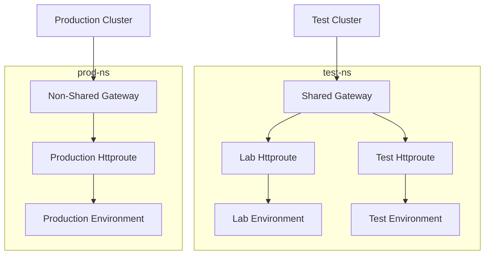

```mermaid
graph TD
    %% Cluster nodes
    A[Test Cluster]
    B[Production Cluster]

    %% Environment nodes
    A1[Lab Environment]
    A2[Test Environment]
    B1[Production Environment]

    %% Environment httproute
    HA1[Lab Httproute]
    HA2[Test Httproute]
    HB1[Production Httproute]

    %% Gateway nodes
    G1[Shared Gateway]
    G2[Non-Shared Gateway]

    A --> G1
    %% Test cluster relationships
    subgraph test-ns [test-ns]
    G1 --> HA1
    G1 --> HA2
    HA1 --> A1
    HA2 --> A2
    end

    B --> G2
    %% Production cluster relationships
    subgraph prod-ns [prod-ns]
    G2 --> HB1
    HB1 --> B1
    end
```
